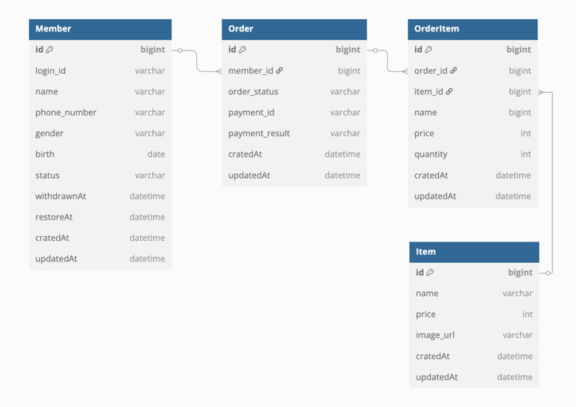

git : https://github.com/keunh/CafeOrder

## 1. 데이터 구조 ERD

## 2. API 명세서

### 1. 멤버 저장

- POST /api/v1/members/member
- 요청
    - loginId : 유니크한 아이디
    - name : 이름
    - phoneNumber : 전화번호
    - gender : 성
    - birth : 생년월일

- 응답
    - memberId : 시스템에서 생성한 멤버 ID
    - loginId : 유니크한 아이디
    - name : 이름
    - phoneNumber : 전화번호
    - gender : 성
    - birth : 생년월일
- 테스트 경로 : /http/member/member.http

### 2. 멤버 조회

- GET /api/v1/members/member/{memberId}
- 요청 파라미터
  - memberId : 시스템에서 생성한 멤버 ID

- 응답
  - memberId : 시스템에서 생성한 멤버 ID
  - loginId : 유니크한 아이디
  - name : 이름
- 테스트 경로 : /http/member/member.http

### 3. 멤버 탈퇴

- DELETE /api/v1/members/member/{memberId}
- 요청 파라미터
  - memberId : 시스템에서 생성한 멤버 ID
- 테스트 경로 : /http/member/member.http

### 4. 멤버 복구

- PUT /api/v1/members/member/restore/{memberId}
- 요청 파라미터
  - memberId : 시스템에서 생성한 멤버 ID
- 테스트 경로 : /http/member/member.http

### 5. 상품 추가

- PUT /api/v1/items/item
- 요청
  - name : 상품명
  - price : 상품가격
  - imageUrl : 상품이미지 URL
- 테스트 경로 : /http/item/item.http

### 6. 주문

- POST /api/v1/orders/order
- 요청 헤더
  - memberId : 멤버ID
- 요청
  - orderItems : 상품 리스트
    - itemId : 상품 ID
    - quantity : 수량
- 테스트 경로 : /http/order/order.http

### 7. 주문 취소

- DELETE /api/v1/orders/order/{orderId}/cancel
- 요청 헤더
  - memberId : 멤버ID
- 요청 파라미터
  - orderId : 주문ID
- 테스트 경로 : /http/order/order.http